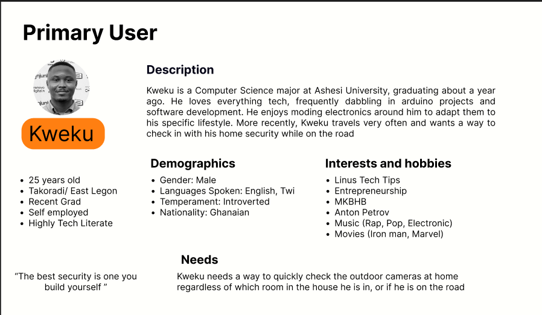
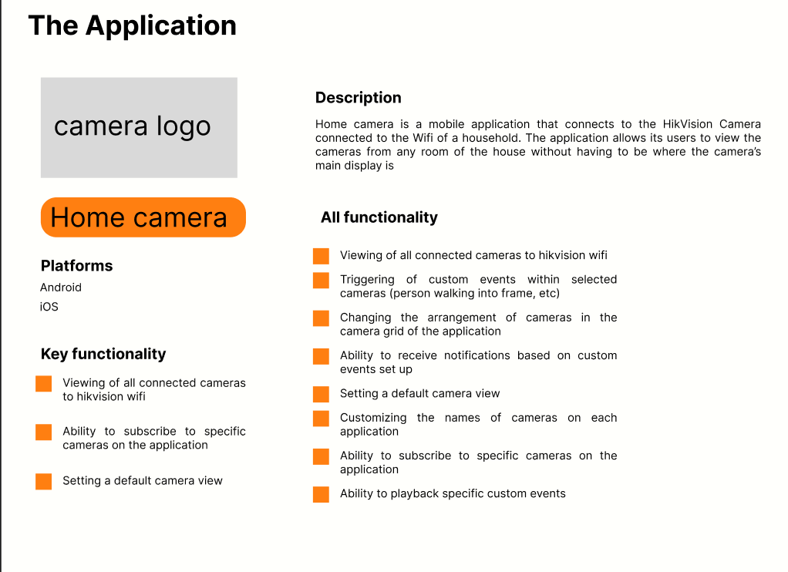
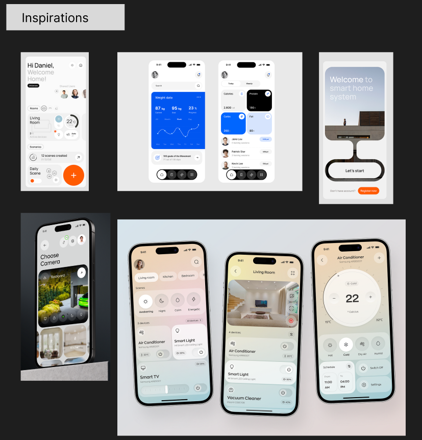
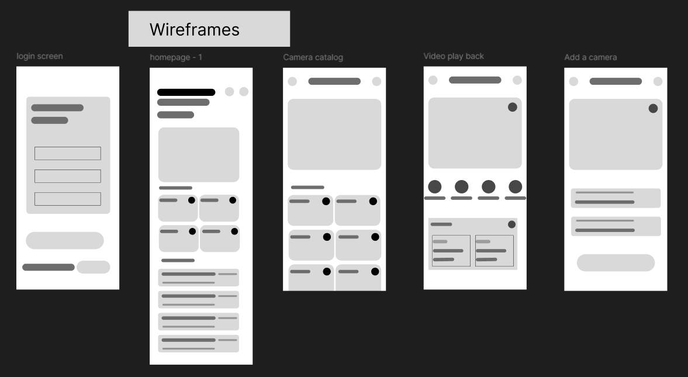
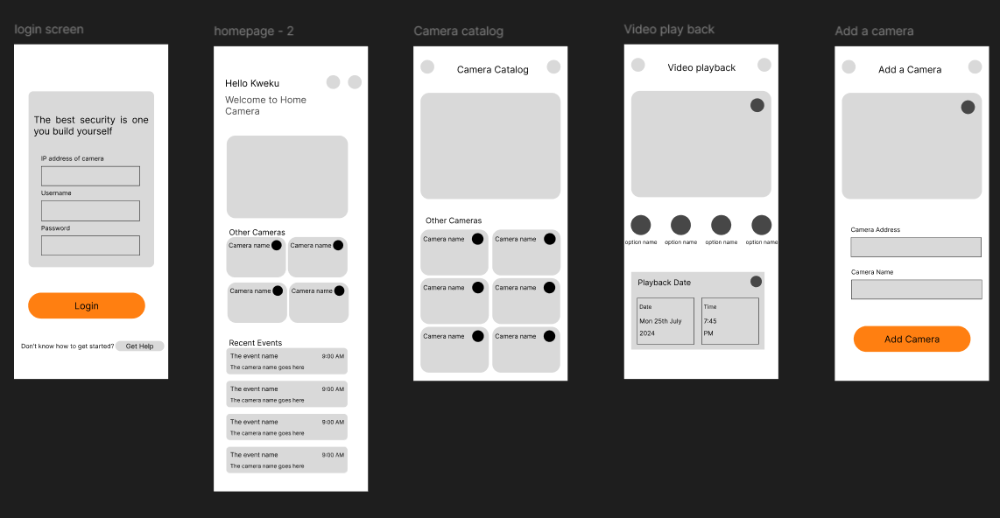

# Home Camera

**There’s no better security system than the one you build yourself!**

## Project Overview
Home camera is a mobile application that connects to the HikVision Camera connected to the Wifi of a household. The application allows its users to view the cameras from any room of the house without having to be in the same room as the main camera

This is a personal project focused on practicing skills i picked up from a Google UX Specialisation course I complied. I also wanted an opportunity to practice my mobile application skills, and work on a project with video

## Application Description
**Home Camera** is a personal project focused on creating a mobile app that connects to home security cameras. The goal of this app is to provide a simple and intuitive way to remotely monitor cameras connected to the home’s WiFi network. The project is aimed at enhancing my UX design skills and combining them with hands-on coding experience, especially in working with video streaming.

While there are plenty of apps in the market that provide similar functionalities, this project focuses on developing a tailored solution for personal use, leveraging the design and development knowledge gained from the Google UX Design Specialization on Coursera.

## Table of Contents
- [User Persona](#user-persona)
- [User Story](#user-story)
- [Project Requirements](#project-requirements)
- [Features](#features)
- [Design Process](#design-process)
- [App Screenshots](#app-screenshots)
- [Setup & Installation](#setup--installation)
- [Technology Stack](#technology-stack)
- [Future Work](#future-work)

## User Persona

Kweku is a Computer Science major at Ashesi University, graduating about a year ago. He loves everything tech, frequently dabbling in arduino projects and software development. He enjoys moding electronics around him to adapt them to his specific lifestyle. More recently, Kweku travels very often and wants a way to check in with his home security while on the road




> **Note:** You can view the design file on the [Figma project](https://www.figma.com/design/OeaOgjO52U8fPe2NFzstLF/Home-Camera?node-id=0-1&t=xRcPazuOsmvydyxx-1).

## User Story

> As a security-conscious, tech-literate user, I want to be able to remotely check the cameras in my house so that I can be aware of activities on the premises.

## Project Requirements


Based on the user persona, the following project requirements were identified:
Based on the user persona, the following primary functionality were identified

1. **Remote Connectivity:** Users should be able to view all the cameras connected to their WiFi.
2. **Event Subscription:** Users should be able to subscribe to specific events or activities (e.g., motion detection).
3. **Default View Configuration:** Users should be able to set a default view on the homepage for quick access.

### Full functionality list

- [x] Viewing of all connected cameras on the local network
- [ ] Triggering of custom events with selected cameras (person walking into frame, etc)
- [ ] Changing the arrangement of cameras in the camera grid of the application
- [ ] Customizing the names of cameras on the application
- [ ] Ability to playback video feed from specific custom events


## Design Process

### 1. **Research and Inspiration**
Taking design inspiration from apps available on the Google Play Store and design platforms like **Dribbble**, the project emphasizes a clean, minimalist interface with a focus on usability and functionality.



### 2. **Wireframing**
I began the design phase by creating wireframes. The focus was on arranging the key elements, like camera feeds, event alerts, and navigation.



### 3. **Prototyping**
I developed a low-fidelity prototype, focusing on core interactions and layouts. This prototype helped me quickly iterate on the user experience without being bogged down by detailed visuals. The design includes a **design system** that provides consistency and helps in maintaining uniformity across the app.

If you are interested in checking out the design, wireframes, and prototype, check the project files on Figma [here](https://www.figma.com/design/OeaOgjO52U8fPe2NFzstLF/Home-Camera?node-id=0-1&t=xRcPazuOsmvydyxx-1).



## App Screenshots

Below are some screenshots of the current version of the **Home Camera** app:

### Home Screen


### Camera Feed


### Event Subscription


## Setup & Installation

### Prerequisites
- **Flutter & Dart:** The project is built using Flutter, which is a cross-platform framework for building apps with a native interface. You’ll need to have Flutter and Dart installed to run this project.

### Installation

1. Clone the repository:
    ```bash
    git clone https://github.com/kwe-k-u/home_camera.git
    cd home_camera
    ```

2. Install the dependencies:
    ```bash
    flutter pub get
    ```


4. Run the app:
    ```bash
    flutter run
    ```

## Technology Stack

- **Frontend:** Flutter (Dart)
- **Design:** Figma (for wireframing and prototyping)


If you have any suggestions or find any issues, feel free to open an issue or submit a pull request. This project is a learning exercise and contributions or feedback are more than welcome!


---

Hope this README helps you get started and gives you a clear idea of what the Home Camera project is about. 😊


